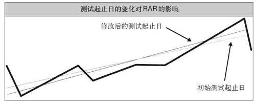
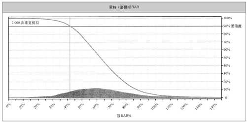

# 历史测试的统计学基础

用拙劣的方法作交易就像是站在暴风骤雨中的一叶小舟上学杂耍。这当然不是办不到的，但踏踏实实地站在地上玩杂耍则容易得多。

## 测试样本的有效性

> 样本分析在统计学上的有效性受两大因素的影响：一个是样本规模，一个是样本对总体是否有代表性。

> 系统测试者假设过去的情况对未来的情况有代表性，如果这是事实，而且我们有足够大的样本，我们就可以从过去的情况中得出结论，并且把这些结论应用于未来的交易。但如果我们的样本对未来不具代表性，那我们的测试就毫无用处，对系统的未来表现也没有任何的指示意义。

> 近期偏好也许就是在交易者身上最常见的迹象——交易者们只注重近期发生的交易，或是仅用近期的数据作历史测试。
>
> 短期测试的问题在于，市场在这段较短的时期内可能仅出现了一两种状态，而不是我们在第二章中所说的全部4种状态。比如，如果市场一直处于稳定波动的状态，那么均值回归和反趋势策略的效果会非常好。但如果市场状态改变了，你所测试的方法可能就不再那么有效了。所以，你的测试方法必须尽可能地提高你所测试的样本对未来的代表性。

## 衡量指标的稳健性

> 指标的不稳定性可能导致测试者过高地评价一个理念，或是盲目地抛弃一个本来很有潜力的理念——因为它受到了不稳定指标的影响，并没有展现出应有的潜力。
>
> 如果对数据稍作改变并不会显著影响一个统计指标，我们就说这个指标是稳健的。在我们对交易系统作历史模拟检验时，参数值的轻微变化就会带来某些指标值的大幅变化。这些指标本身就是不稳健的——也就是说，它们对数据的轻微变化太过敏感。任何对数据有影响的因素都会对测试结果产生过大的影响，这很容易导致数据拟合，很容易让你被不切实际的测试结果所迷惑。

> 前面的章节把MAR比率、平均复合增长率和夏普比率用作相对表现的衡量指标。但这些指标并不稳健，因为它们对测试期的起始日和终止日非常敏感。这对短于10年的测试来说尤其明显。

## 回归年度回报率

> **线性回归分析**
>
> 回归线就是最符合散点分布趋势的一条线，有时候也被称为最佳拟合线。你可以把它理解为穿越所有散点中心位置的一条直线，回归过程就像是揪住散点图的两端将它不断拉伸，保持图形的整体方向不变，直到所有的起伏之处消失，聚合为一条直线。
>
> 线形回归线和它所代表的回报率为我们提供了一个新指标，我称之为回归年度回报率。这个指标对测试期起止日的变化远不像平均复合增长率那样敏感。从图中可以看到，当回归年度回报率的测试起止日改变时，回归线斜率的变化要小得多。
>
> 

> 衰落程度只是个一维的指标，并不是所有的30%衰落幅度都有同样的意义。如果一个系统仅经历了两个月的衰落就转而创出新高，我并不会太在意，但一次持续两年的衰落就是另外一回事了。恢复时间或衰落期的长度本身也是非常重要的。

## 稳健风险回报比率

> **稳健风险回报比率（或R立方）**
>
> R立方的分子就是回归年度回报率，分母也是个新指标，我称之为长度调整平均最大衰落。这个分母指标有两个要素：平均最大衰落和长度调整。
>
> 平均最大衰落就是5次最大衰落幅度的平均值。长度调整就是将这5个衰落期的平均天数除以365天，然后用这个结果乘以平均最大衰落。平均衰落天数的计算原理与平均衰落幅度相同，也就是将5次衰落期的天数相加再除以5。因此，如果回归年度回报率是50%，平均最大衰落是25%，而平均衰落长度是1年，也就是365天，那么R立方就等于2.0——也就是50%/(25%×365/365)。

## 稳健夏普比率

> 稳健夏普比率就是回归年度回报率除以年度化的月度回报标准差。这个指标对数据变化的敏感度较低，原因与回归年度回报率的敏感度低于平均复合增长率的原因相同。稳健指标对测试起止日的变化远不如普通指标敏感。

> 相比不稳健指标，**稳健指标也不太容易受到运气因素的影响**。
> 
> 如果你用的是不稳健指标，那么你所得到的理想结果更有可能是好运所致，而不是可以利用的重复性市场行为模式。
>
> 使用稳健指标还能帮助你避开过度拟合的危害，因为它们不太容易因为数据的微小变动而发生大的变化。
>
> 稳健指标不太容易因为少数交易的调整而呈现大的改进。因此，由于曲线拟合手段往往只是对少数交易有益，如果你使用稳健指标，你就不太容易用曲线拟合的手段来显著改善系统的表现。

## 样本的代表性

> 我们的样本交易和检验结果对未来有多大的代表性是由两大因素决定的：
> - **市场数量**：我们所测试的市场越多，我们就越有可能将市场的各种不同状态包含在内。
> - **测试时间**：时间跨度较长的测试会涵盖更多的市场状态，而且更有可能将具有未来代表性的历史时期包含在内。

> 年轻的交易者特别容易犯这种错误。他们相信他们所看到的状态就是市场整体状态的代表，而往往意识不到市场具有周期性和多变性，经常回归到过去曾经出现过的状态。就像在生活中一样，年轻人往往看不到历史的价值，就因为历史发生在他们出生之前。年轻是好事，但不要太愚蠢——一定要学历史。

## 样本规模

> 样本规模这个概念很简单：你需要一个足够大的样本才能进行有效的统计学推理。样本越小，推理就越粗糙；样本越大，推理就越准确。这方面不存在某个神奇的标准数字，样本就是越大越好，越小越糟。不到20的样本规模会导致严重的偏差；超过100的样本规模更具预测价值；达到数百的样本规模也许对大多数测试来说就够用了。

> 有两种常见的做法可能将小样本规模的问题进一步放大：一个是单一市场最优化，一个是系统设计过于复杂。
> - **单一市场最优化**：单独应用在各个市场中的最优化方法更难用足够大的样本进行测试，因为单个市场上的交易机会要少得多。
> - **过于复杂的系统**：复杂的系统有很多法则，有时候很难判断某一条法则发挥作用的频率或程度。因此，如果用过于复杂的系统进行测试，我们更难对测试结果的说服力抱有信心。
>
> 出于这些原因，我不建议针对单个市场进行最优化，而且我更喜欢具备统计学意义的简单理念。

## 从虚拟测试到实战交易

> 你必须理解影响系统表现的因素，使用稳健指标的必要性，以及采集足够大的代表性样本的重要性。

### 参数调整测试

> 在决定采用一个系统之前先检验一下参数的作用是个很好的习惯，我称之为参数调整测试。挑出几个系统参数，大幅调整参数值，比如20%~25%，然后看看效果怎么样。你可以把参数值调整到远离最优点的地方。

### 滚动最优化窗口

> 随便选择8~10年前的一天，用这一天之前的所有的数据进行最优化——要使用你平常所用的最优化方法，作出你平常会作出的权衡决策，就如同你只有截至那一天的数据。当你得出了“最优化”参数值后，再用这一天之后两年内的数据检验一下这些参数值。系统在这两年内的表现怎么样呢？
> 
> 接下来，把测试终点向后顺延两年（也就是6~8年前的一天），再测试一次。比起上一次测试和上一个滚动窗口，这一次有什么变化？比起你最初的参数值，也就是用所有可用数据计算出的最优值，这一次又有什么不同？继续向后顺延，重复这个程序，直到延伸至今天。

## 蒙特卡洛检验

> 有些方法用随机数据来模拟某种特定现象，蒙特卡洛检验就是这类方法的统称。对不可能或很难用数学方法来精确描述的现象来说，这种方法最为有用。

### 别样景象

> 要用蒙特卡洛检验来生成别样景象，我们有两种常见方法可用：
> - **交易调整**：随机性地改变实际模拟结果中的交易命令和起始日，然后用调整后的交易命令和这些交易的损益水平来调整资产净值。
> - **净值曲线调整**：在初始净值曲线中随机选择一些部分，将它们组合成新的净值曲线。
> 
> 在这两种方法中，净值曲线调整所生成的别样净值曲线更具现实性，因为随机改变交易命令的蒙特卡洛检验很容易低估衰落的可能性。
> 
> 最大衰落总是发生在大趋势的末端或资产呈增长趋势的时期。因为在这些时候，市场之间的相关性要高于平常。期货和股票市场都是如此。当大趋势在走到尽头后崩溃并逆转时，似乎所有事情都开始对你不利，即使是平常看似不相关的市场，也开始在这些起伏不定的日子相互挂钩了。
> 
> 由于交易调整法去除了交易和日期的关联性，它也去除了多个同时逆转的交易对净值曲线的不利影响。这意味着蒙特卡洛检验中的衰落程度和频率要比现实中低。

> 许多有蒙特卡洛检验功能的软件可以用净值曲线调整法生成新的曲线，但它们没有考虑到另外一个重要的问题。根据我的测试和实践经验，我发现大趋势末端的衰落时间和程度远不是随机模拟结果可以比拟的。在这些大衰落期间，趋势跟踪系统的净值曲线呈现出序列相关性——也就是说，今天的资产变化与前一天的资产变化是相互关联的。更简单地说，坏日子往往集中出现，接踵而来，这并不是随机性事件的特征。
> 
> 考虑到这个问题，我们公司的模拟软件在调整净值曲线的时候也允许随机截取多个交易日的整段曲线，而不仅仅是单个交易日的数据。这样，模拟净值曲线就会把集中而来的不利变化保留下来，如实反映实际交易中的状况。

### 别样净值曲线

> 
> 
> 像这样的图非常有用，因为你可以从中认识到未来不可确知，有很多种可能性。不过你也不要过于深究这类报告的细枝末节。不要忘了，这些数据来自于模拟的净值曲线，而净值曲线以历史数据为基础，自然摆脱不了第十一章所说的所有那些潜在缺陷。如果最初的测试就很糟糕，蒙特卡洛检验也不会是救世主，因为它本身就源自于最初的测试，不可能超然于原始数据之上。如果最优化矛盾导致回归年度回报率被高估了20%，那么蒙特卡洛检验所模拟出的别样净值曲线同样会将回归年度回报率高估20%，因为它使用的是同样的最优化参数值。
> 
> 综上所述可知，历史测试充其量只是对未来趋势的粗略估计。稳健指标对未来表现的预测价值要高于较为敏感的指标，但仍然谈不上精确。

