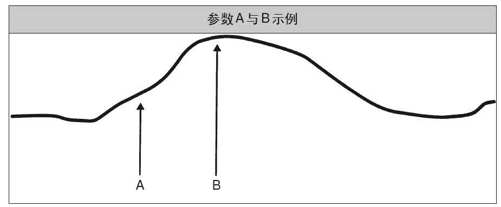
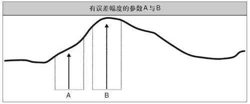

# 历史测试的谎言

骗子和无赖潜伏在黑暗的角落里，等待着不设防的猎物。不要成为他们的盘中餐。

> 历史测试结果和实际交易结果的差异主要是由四大因素造成的：
> - **交易者效应**：如果一种方法在近期赚了很多钱，那么其他交易者很可能会注意到它，开始用类似的方法模仿它，这很容易导致这种方法的效果不再像一开始那样好。
> - **随机效应**：历史测试的结果夸大了系统的内在优势也可能是纯随机性的现象。
> - **最优化矛盾**：选择特定参数的过程（比如选择25日移动均线而不是30日移动均线），可能降低事后测试的预测价值。
> - **过度拟合或曲线拟合**：系统可能太过复杂，以至于失去了预测价值。由于它与历史数据的吻合度太高，市场行为的一个轻微变化就会造成效果的明显恶化。

## 交易者效应

> 交易行为本身有可能改变交易赖以成功的潜在市场状态。任何一件不断重复的事情都有可能被市场参与者注意到。同样的，一种在近期表现得特别突出的策略也很有可能被诸多交易者注意到。但是，如果太多的交易者都开始尝试着利用同一种策略，这种策略将不再像从前那样有效。

> 开发你自己的系统要强于追随别人的系统。如果你能开发出自己的系统，你的优势就不太容易被其他交易者毁掉，因为他们不会知道你什么时候买入或卖出。

> 海龟们也会想办法稍稍迷惑一下那些试图猜透理查德·丹尼斯的人。我们有的用小止损标准，有的用大止损标准，有的在突破发生时买入，有的在突破之后买入，还有的在突破之前买入。加在一起，我们放出了不少烟幕弹，可能对丹尼斯执行他的交易帮助不小。

## 随机效应

> 纯随机性事件可以导致巨大的交易结果差异。超常的表现也可能源于随机效应，而不是什么卓越的策略。

> 运气或者说随机性因素对交易者和基金的表现有举足轻重的影响，尽管那些交易精英们不愿意对他们的投资者们承认这一点。历史表现在投资者眼中就是响当当的硬证据，但实际上并没有那么硬。历史表现的好坏也是有运气成分的。只盯着历史记录，你是分不清实力与运气的。随机效应太大、太普遍，所以你不可能得出确凿无疑的结论。

### 幸运儿

> 当你用业绩衡量指标去区分好基金和坏基金的时候，你很容易遭遇随机效应问题。因为运气好的平庸交易者要多于运气不佳的优秀交易者。

### 真正优秀的交易者

> 时间更加垂青真正优秀的交易者，而不是那些平庸的幸运儿。

> 好的投资者投资于人，而不是历史记录。当他们观察交易者时，他们知道哪些特征预示着未来的优异表现，哪些特征反映了平庸的能力。这是克服随机效应的最佳方式。

## 最优化矛盾

> 有许多交易者认为最优化不是件好事，因为它会导致曲线拟合现象和拙劣的表现。我说这是一派胡言！

> 有些交易者之所以认为最优化有害或有危险性，只是因为他们不理解最优化矛盾，而且曾见识过不恰当最优化的恶果——这种不恰当的最优化正是统计学中所说的过度拟合现象的根源。
> 
> 所谓最优化矛盾，是指参数最优化过程有两种相互矛盾的效果：一方面可以提高系统在未来表现良好的概率，另一方面却会降低系统的未来表现符合模拟测试结果的概率。这样，参数最优化虽然提高了系统的预期表现，但也降低了历史模拟指标的预测价值。我相信，正是因为对这种矛盾理解不足，许多交易者才会怀着对过度最优化和曲线拟合的恐惧而对最优化避之唯恐不及。但在我看来，恰当的最优化永远是明智的。
> 
> 使用恰当的最优化所得出的参数值可以提高系统在实际交易中获得理想结果的可能性。

> 不做最优化意味着糊里糊涂地被运气因素完全左右。发现了调整这个参数的影响，我们就更好地理解了入市标准参数的作用和交易结果对这个参数的敏感性。

### 最优化参数

> 之所以说历史测试有预测价值，是因为历史测试结果可以对交易者在未来的表现提供一些指示。未来与过去越接近，未来的交易结果就越接近于历史模拟结果。作为系统分析的一种方法，历史测试也有一个很大的问题，那就是未来永远也不会等同于过去。但一个系统确实能利用反映在市场中的人类永恒行为特征来赢利，从这个角度看，过去就是对未来的模拟，尽管不是精确的模拟。用全部经过最优化的参数得出的历史检验结果代表着非常特殊的交易结果，也就是这个使用最佳参数的系统用于过去的实战中将产生的交易结果。因此，这个模拟结果就代表着最乐观的历史回顾。

> 如果说A值代表着一个非最优化参数值，B值代表着一个最优化参数值，那么我会说：B值用在实际交易中更好，但如果用B值，未来的实际交易结果可能逊于用B值进行历史测试的结果。

> A、B点的相对位置在未来的可能移动范围，我们称为误差幅度。
> 
> 对A点来说，如果它的相对位置左移，它所对应的系统表现就要低于A点；如果它的位置右移，系统表现就会提高。因此，参数值A下的测试结果有不错的预测价值，不管未来如何变化，因为它高估和低估未来表现的可能性是相同的。
>
> 但B点就不一样了。不管向左还是向右移，系统表现都会下降。这意味着B值下的预测结果很有可能高估未来的实际结果。假如这种效应通过多个不同的参数而复合放大，那么未来变化的影响也会复合放大。这意味着，如果有很多参数都是最优化的，那么未来的实际结果与这些最优化参数值下的预测结果就很难吻合。
>
> 但这并不意味着我们应该在实际交易中使用参数A。因为即使未来的变化幅度相当可观，B点左右的系统表现仍然高于A点左右的系统表现。因此，尽管最优化过程降低了预测价值，你仍然应该采用最优化参数，因为最优化参数更有可能带来理想的结果，不管未来如何变化。
> 
> 最优化矛盾已经成了骗局和诡计的温床。有很多不道德的系统兜售者大肆炫耀他们靠特定市场上的最优化（特别是短期最优化）所得出的超高利润和不可思议的优异表现，但他们知道这样的历史测试结果不可能在实际交易中实现。不过，最优化会导致虚夸现象并不意味着我们不应该最优化。事实上，要想建立有效的交易系统，最优化是至关重要的。

## 过度拟合或曲线拟合

> 人们常常将过度拟合与最优化矛盾混为一谈，但实际上它们不是一回事。
> 
> 过度拟合通常发生在系统变得过于复杂的时候。有时候，你可以通过添加法则来提高一个系统的历史表现，但这仅仅是因为这些法则影响了屈指可数的几笔重要交易。添加法则会导致过度拟合，这对发生在关键时期的交易来说尤其明显。

> 我曾见过许多系统兜售者在一段相对低迷的时期后用这种手段来提高他们的系统表现。他们有时候会把修改过的系统称为原版系统的“加强版”或“二代”。如果你想购买这一类的“加强”系统，你应该好好研究一下那些新添加的法则，确保那些改进不是过度拟合的结果。

> 参数值的微小变化却引发了交易结果的剧烈变化，这种现象被交易者们称为**峭壁**。峭壁的出现是个很好的信号，这证明你可能已经犯了过度拟合的错误，而且你的实际交易结果可能会与测试中的结果大相径庭。峭壁现象也是我们认为参数最优化有益的原因之一：通过最优化程序，你可以发现峭壁，在开始交易之前就修正这个问题。

### 样本规模的统计学价值

> 人们往往对某种特定现象的少数事例过于重视，但却忽略了一个重要事实：从统计学上说，我们从寥寥几个例子中得不出太多的结论。这个问题就是过度拟合的主要缘由。添加某些不太经常发挥作用的法则会导致无意中的过度拟合，而这会造成事后测试结果与实际交易结果的差异。

