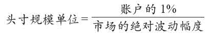

# 原版海龟交易法则

我说过很多次，你可以把我的交易法则登在报纸上，但没人会遵守它们。关键是统一性和纪律性。几乎每一个人都可以列出一串法则，而且不比我们的那些法则差多少。但他们不能给别人信心，而唯有对法则充满信心，你才会坚持这些法则，即使遭遇逆境。

## 完整的交易系统

> 完整的交易系统所应该有的所有成分，涵盖了成功交易中的每一个必要决策：
> - 市场：买卖什么？
> - 头寸规模：买卖多少？
> - 入市：什么时候买卖？
> - 止损：什么时候放弃一个亏损的头寸？
> - 退出：什么时候退出一个赢利的头寸？
> - 战术：怎么买卖？

> 使用机械性的交易系统是保持行动统一性的最佳方法。如果你知道你的系统能在长期内赚钱，你就更容易遵守交易信号，在亏损时期也坚持你的系统。这里有必要再强调一下：如果你依赖的是自主判断，那么你往往会在应该大胆的时候畏首畏尾，在应该谨慎的时候却莽撞激进。

## 市场：海龟们的选择

> 海龟们只选流动性最高的市场。事实上，流动性是理查德·丹尼斯为海龟们选择市场的首要标准。

> 海龟们有权不选择上述任何一种产品，但是，一旦一个海龟排除了某一个市场，他就再也不能进入这个市场。因为我们要保持行动的统一性。

## 头寸规模

> 如果一个市场的合约价值波动性较强，那么这个市场中的合约持有量就少一些；相反，如果一个市场的波动性较弱，这个市场中的头寸就可以大一些。总之，市场的波动性与头寸的规模是呈反比的。

### 波动性：N的含义

> N就是真实波动幅度的20日指数移动平均值，现在更常见的名称是真实波动幅度均值（或ATR）。从理论上说，N代表着一个市场在一天内的平均波动幅度，包括开盘跳空的情况在内。

### 波幅调整后的头寸单位

> 一个特定市场或产品的头寸规模单位可以用下列公式算出：
>
> 
>
> 或者
>
> 

### 风险与头寸单位

> 4个层面的限制：
> 层面 | 限制范围 | 头寸单位上限
> --- | --- | ---
> 1 | 单个市场 | 4
> 2 | 高度关联的多个市场 | 6
> 3 | 松散关联的多个市场 | 10
> 4 | 单个方向（多头或空头） | 12

> - 单个市场：每一个市场中的头寸单位不得超过4个。
> - 高度关联的多个市场：在紧密关联的市场中，我们在某一个方向上的头寸单位不得超过6个（也就是说，空头单位最多6个，多头单位也最多6个）。
> - 松散关联的多个市场：对松散关联的市场来说，我们在某一个方向上的头寸单位不得超过10个。
> - 单个方向（多头或空头）：任何一个方向上的总头寸单位都不得超过12个。因此，一个海龟从理论上说可以同时持有12个空头单位和12个多头单位。

### 调整交易规模

> 每当我们损失了初始账户的10%时，里奇都会把我们的账户规模缩减20%。这样，如果我们的100万美元初始账户损失了10%，也就是10万美元，我们的账户规模将会下调到80万美元，直到账户净值恢复到年初水平。如果我们又一次损失了10%（80万美元的10%，也就是8万美元，这样总损失达到了18万美元），我们就得把账户再压缩20%，这样就只剩下了64万美元的名义账户。
> 
> 根据盈亏状况调整账户规模可能还有更好的方法。以上只是海龟们的方法。

## 入市策略

### 突破

> 海龟们总是在突破发生时立即入市交易，不会等到当日收盘或次日开盘时。在跳空开盘的情况下，假如开盘价已经跳过了突破价，海龟们就在开盘时入市。

### 系统1入市法则

> 如果价格超越了20日高点，海龟们就买入1个头寸单位，开始做多。如果价格跌破了20日低点，海龟们就卖出1个头寸单位，开始做空。
> 
> 但是，假如上一次突破是一次赢利性突破（也就是可以带来一次赢利的交易），那么系统1的当前入市信号将被忽略。

### 系统2入市法则

> 如果价格超越了55日高点，海龟们就买入1个头寸单位，开始做多。如果价格跌破了55日低点，海龟们就卖出1个头寸单位，开始做空。
> 
> 对系统2来说，所有突破都被视为有效信号，无论上一次突破是亏损性还是赢利性的。

### 逐步建仓

> 海龟们首先在突破点建立1个单位的头寸，然后按1/2N的价格间隔一步一步扩大头寸。

### 统一性

> 里奇要求海龟们坚定不移地遵守入市信号，因为一整年的大部分利润很有可能就来自于两三次大的赢利交易。哪怕你只忽略或错过了一个信号，这一年的回报率也可能大打折扣。

## 止损

> 几乎所有失去控制的致命交易行为都与不能防微杜渐、及时控制损失有关。
> 
> 要控制损失，最重要的一件事就是在入市之前就确定退出的标准。一旦价格到达了你的止损标准，你必须退出——坚定不移，无一例外。犹豫和动摇终将酿成灾难。

### 止损点

> 海龟们根据头寸风险来设定止损标准。任何一笔交易的风险程度都不得超过2%。
> 
> 由于1N的价格变动代表着账户净值的1%，在2%的风险限制下，价格变动的上限就是2N。海龟们止损标准就是2N：对多头头寸来说，止损价比入市价低2N；对空头头寸来说，止损价比入市价高2N。
> 
> 一般来说，这意味着整个头寸的止损点将与最新添加的头寸单位相距2N的距离。

## 退出

> 趋势跟踪者们最常犯的错误之一就是过早地退出赢利的头寸，也就是过早地“落袋为安”。
>
> 价格永远也不会直上直下，没有波动。因此，要想抓住一次趋势，你必须允许价格偶尔向不利的方向变动。在趋势的初期，这往往意味着10%~30%的利润在你眼前化为乌有，反而转为小小的损失。在趋势的中期，你或许会眼睁睁地看着80%~100%的利润跌去三四成。在这些情况下，放掉包袱、“锁定利润”的诱惑是很强大的。
> 
> 海龟系统在突破点入市，但大多数突破点都不会引发趋势。这意味着海龟们的大多数交易都是亏损的。如果少数赢利的交易赚不到足够多的钱来弥补这些损失，海龟们会是输家。每一个有效的交易系统都有自己的最佳退出点。

### 海龟退出策略

> 系统1采用10日突破退出法则：对多头头寸来说，在价格跌破过去10日最低点时退出；对空头头寸来说，在价格超过10日最高点时退出。总之，如果价格发生了不利于头寸的10日突破，所有头寸单位都要退出。

> 系统2则采用20日突破退出法则：对多头来说是20日向下突破，对空头来说是20日向上突破。只要价格发生了不利于头寸的20日突破，所有头寸单位都会退出。

### 退出不易

> 对大多数交易者来说，海龟系统的退出策略可能是整个系统中最难忍受的一个环节。你必须等待市场创下10日或20日新低才能退出，这往往意味着目睹20%、40%甚至100%的巨额利润瞬间蒸发。
> 
> 所以，交易者总有一种提早退出的强烈冲动。你需要极强的纪律性才能坚守阵地，忍受利润的蒸发，直到抓住真正的大趋势。在大的赢利交易中遵守纪律和法则的能力就是经验丰富的成功交易者们的标志。

### 下单

> 限价定单总的来说要强于市价定单。相比起市价定单，限价定单更容易以更有利的价格成交，成交价偏差也要小一些。

> 一个小的限价定单不会触动市场，即使定单较大，它对市场的触动也小于市价定单。

### 买强卖弱

> 在同一类相互关联的市场中，最好的多头交易都存在于最强势的市场中（这些市场的表现几乎必然强于较弱的同类市场）。同样，最好的空头交易都存在于最弱势的市场中。

> 总而言之，要点在于在最强的市场上做多，在最弱的市场上做空。

