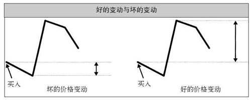

# 发现系统优势

能否掌握优势是区分专家与业余人士的关键。忽视了这一点，你就会输给那些没有忽视这一点的人。

> 交易中的优势是指一种可以利用的统计学优势，它以市场行为为基础，而这些市场行为是会重复发生的。在交易世界中，最好的优势来自于人类认知偏差所酿成的市场行为。

## 系统优势的三大要素

> 系统优势来自于三大要素：
> - **资产组合的选择**：决定应该进入哪些市场的运算系统。
> - **入市信号**：决定什么时候开始一笔交易的运算系统。
> - **退出信号**：决定什么时候退出一笔交易的运算系统。

## 优势比率

> 交易者们把往坏方向的最大变动幅度称为MAE（maximum adverse excursion，最大不利变动幅度），把往好方向的最大变动幅度称为MFE（maximum favorable excursion，最大有利变动幅度）。

> 如果好方向的平均最大变动幅度大于坏方向的平均最大变动幅度（也就是说平均MFE高于平均MAE），这说明存在正的优势。如果平均MAE（不利变动）高于平均MFE（有利变动），这说明存在负的优势。

> 我们已经发明了一种我们称之为**E–比率**（优势比率的简称）的入市优势衡量指标。这个E–比率通过以下公式将上述所有要素结合了起来：
> 1. 为每一个入市信号计算指定时间段内的MFE和MAE。
> 2. 将上述各MFE和MAE值分别除以入市时的ATR，这是为了根据波动性作出调整，将不同市场标准化。
> 3. 将上述调整后的MFE和MAE值分别求和，然后除以入市信号的总次数，得出调整后的平均MFE和MAE。
> 4. 调整后的平均MFE除以调整后的平均MAE就是E–比率。
>
> E–比率可以用来衡量一个入市信号是否具有优势。

> 根据唐奇安通道突破法则，你应该在价格突破过去20天内的最高点时买入，在价格跌破过去20天内的最低点时卖空。而趋势组合过滤器规定，你只能在50日均线高于300日均线的市场中做多，在50日均线低于300日均线的市场中做空。如果一个市场的状态对系统不利，这个趋势组合过滤器就会把这个市场剔除。

## 趋势组合过滤器

> 使用趋势组合过滤器大大提高了突破法交易获得理想结果的可能性。另外，如果将趋势组合过滤器与突破法相结合，优势比率曲线图的形状会改变，而且会变得更加平滑。
> 
> 之所以如此，是因为与长期趋势相违背的突破交易都被剔除了。许多对初始头寸不利的重大变动都是由这些交易造成的，因为与一个大趋势方向相反的突破很难长时间维持下去。这些突破的发生也说明市场正处于一种不利于唐奇安趋势系统的状态中。

## 退出策略的优势

> 如果有可能的话，即使是系统的退出策略也应该有优势。遗憾的是，衡量退出策略的优势更不容易。这是因为退出策略与入市策略和退出信号都有关系。换句话说，你不能抛开最初建立一个头寸的缘由而去单独考察退出策略。这里面不止有一个系统要素，而是有多个不同要素，而且它们之间有着错综复杂的交互作用。

