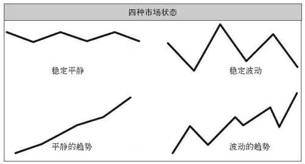

# 揭秘海龟思维

在交易世界里，人类的情绪既是机会所在，也是最大的挑战。掌控了它，你就能成功。忽视了它，你就危险了。

> 人类在不确定的环境中容易犯下系统性的错误。在紧张的情绪中，人类对风险和事件的概率会做出糟糕的判断。有什么事能比赚钱或赔钱更令人紧张的呢？行为金融学已经证明，当涉及这类利益问题的时候，人类很少能做出完全理性的决定。

## 情绪陷阱

> 每个人的身上都有根生蒂固的系统性、重复性的非理性，而交易者的非理性会导致市场的波动。海龟交易法则之所以有效，而且始终有效，原因就在于它是以这种来源于非理性的市场波动为基础的。

> 在那些较为简单原始的环境中，人类已经形成的某些特定的世界观对他们大有帮助，但在交易世界中，这些认知反而成了障碍。人类认知现实的方式可能出现扭曲，科学家将其称为认知偏差。以下是几种对交易行为有影响的认知偏差：
> - **损失厌恶**：对避免损失有一种强烈的偏好。也就是说，不赔钱远比赚钱更重要。
> - **沉没成本效应**：更重视已经花掉的钱，而不是未来可能要花的钱。
> - **处置效应**：早早兑现利润，却让损失持续下去。
> - **结果偏好**：只会根据一个决定的结果来判断它的好坏，而不去考虑决定本身的质量。
> - **近期偏好**：更重视近期的数据或经验，忽视早期的数据或经验。
> - **锚定效应**：过于依赖（或锚定）容易获得的信息。
> - **潮流效应**：盲目相信一件事，只因为其他许多人都相信它。
> - **小数定律**：从太少的信息中得出没有依据的结论。

> 对交易行为来说，损失厌恶可以影响一个人使用机械性交易系统的能力，因为使用这类系统的人对损失的感受要强于对潜在盈利的感受。一个人可能因为遵守系统的法则而赔钱，也可能因为错过一个机会或忽视系统的法则而赔掉同样多的钱，但前者带给人的痛苦要远大于后两者。割肉退出对一个有损失厌恶的交易者来说是件极端痛苦的事，因为这会让损失变成板上钉钉的事实。

> 处置效应是指投资者倾向卖掉价格正在上涨的股票，却保留价格正在下跌的股票。早早兑现利润的倾向也来源于人们不愿意丢掉盈利机会的倾向。对怀有这种倾向的交易者来说，弥补大损失是很难的，因为能够赚大钱的交易早早就被终结，交易的潜力也就永远失去了。

> 结果偏好会导致人们过于重视实际发生的事情，忽视决定本身的质量。在交易世界中，即使是正确的方法也有可能赔钱，甚至有可能连续赔钱。这些损失会导致交易者怀疑自己，怀疑自己的决定程序，于是对自己一直在使用的方法做出负面的评价，因为这个方法的结果是负面的。

> 近期偏好是指一个人更重视近期的数据和经验。近期的一连串不成功的交易会导致交易者怀疑他们的方法和决定程序。

> 锚定效应是指人们在做出一个涉及不确定性的决定时过于依赖那些容易获得的信息。他们可能会盯着近期的一个价位，根据当前价格与这个参考价格的关系来做出决定。

> 人们往往会因为其他人的相信某件事就随波逐流地相信这件事，这被称为潮流效应或羊群效应。价格之所以会在泡沫行将破裂的时候仍然疯涨不止，部分原因就在于这种潮流效应。

> 被小数定律迷惑的人相信，一个小样本就可以近似准确地反映总体情况。小样本对总体来说并没有太大的代表性。信奉小数定律会导致人们过早地建立信心，或过早地失去信心。再加上近期偏好和结果偏好的影响，交易者往往会在一个有效的系统刚要开始发挥作用的时候就将它抛弃。

## 海龟交易策略

> 各种类型的交易策略或风格都有其忠实信徒。事实上，有些交易者对他们的特殊风格推崇之至，以至其他任何风格都难入他们的法眼。我没有这种偏见。任何有效的方法都是好方法。固执地坚持一种方法而排斥其他方法是愚蠢的。

### 趋势跟踪

> 一般来说，趋势跟踪系统的衰落程度大致接近其回报水平。所以，如果一个趋势跟踪系统的期望回报率是每年30%，那么在衰落期内，你的账户价值可能从高点下跌30%。趋势跟踪法需要动用相对较大的资金量才能确保合理的风险控制，因为这种方法的入市价位与不利局势下的止损退出价位有很大的差距。如果资金太少，使用趋势跟踪策略会大大提高破产出局的概率。

### 反趋势交易

> 这类交易者不是在市场创新高的时候买入，而是在价格接近新高的时候卖空。他们的理论依据是：新高的突破大多不会引发市场趋势。

### 波段交易

> 波段交易本质上与趋势跟踪交易相同，只不过它瞄准的是短期市场动向。

### 当日交易

> 一个真正的当日交易者总是试图在每天的交易结束之前退出市场。

## 市场状态

> 
> 
> - **稳定平静**：价格在一个相对较小的范围内上下波动，很少超出这个范围。
> - **稳定波动**：有大的日间或周间变化，但没有重大的月际变化。
> - **平静的趋势**：价格在几个月中呈现出缓慢的运动或趋向，但始终没有剧烈的回调或反方向运动。
> - **波动的趋势**：价格有大的变化，偶尔伴有剧烈的短期逆转。

> 趋势跟踪者们喜欢平静的趋势。反趋势交易者喜欢稳定中有波动的市场。波段交易者喜欢波动性市场，不管有没有趋势。

